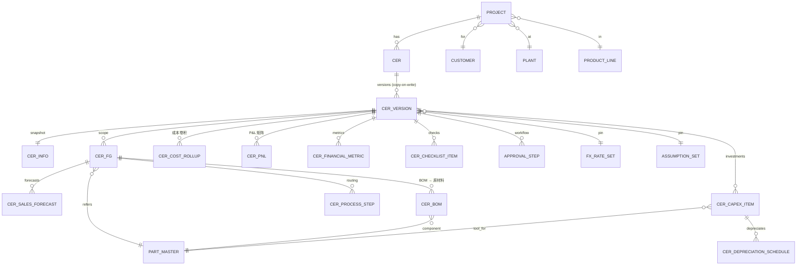

# CER 管理平台 — 数据模型设计 (v1)

> 目标：把现行基于 Excel 的 CER workbook（33 个 sheet）归一为一个**规范化、可版本化、可审计**的关系型数据模型，作为 B/S 应用后端的地基。
> 设计路线 = #3 混合：**前台保留 Excel 级录入体验，后台严格按模板勾稽建模**。
> 参考样本：`PRJ-24-000902644 · Charging Inlet-Gen2 GB Actuator · G4`。

---

## 1. 设计原则

| # | 原则 | 说明 |
|---|------|------|
| P1 | **分层** | Master Data（共享主数据）/ CER Document（版本化业务数据）/ Calc Output（物化计算结果）/ Workflow（流程审计）四层解耦。 |
| P2 | **版本即快照** | 一个 `cer_version` 拥有该版本**全部输入行**的独立副本（copy-on-write）。新建版本 = 克隆上一版输入。点时间可完整重建，diff/审计天然成立。 |
| P3 | **批准即冻结** | 进入 `APPROVED` 的版本只读；任何修改必须派生新的 `DRAFT` 版本。 |
| P4 | **假设可复现** | 每个版本固化（pin）所引用的 FX、费率、假设集的**主键 + 解析值**，主数据后续变更不影响历史版本重算。 |
| P5 | **输出物化但可重算** | NPV/折旧/成本卷积等结果按版本物化存储（审计留痕），同时记录 `engine_version` + `calc_hash` 保证可重算一致性。 |
| P6 | **自然键驱动 diff** | 每版输入行带稳定自然键（如 capex 行 = 零件号+类别，BOM 行 = 组件PN），跨版本按自然键匹配 → 新增/删除/变更，驱动"v4.1→v4.2"对比。 |
| P7 | **货币中性** | 金额一律存**原始录入币种 + 币种码**，并冗余存一份折算后的报告币（USD），折算用版本固化的 FX。 |

---

## 2. 分层总览

```
┌─────────────────────────────────────────────────────────────────────┐
│ L0  MASTER / REFERENCE (跨 CER 共享, 按生效期/财年版本化)               │
│  currency · fx_rate_set · assumption_set · labor_rate · overhead_rate  │
│  burden_rate · duty_rate · plant · product_line · customer · oem       │
│  part_master · material_master · gate_definition                       │
└───────────────┬─────────────────────────────────────────────────────┘
                │ 引用 (pin by id+value)
┌───────────────▼─────────────────────────────────────────────────────┐
│ L1  PROJECT                                                            │
│  project (PRJ-…) — 1:N → cer                                           │
└───────────────┬─────────────────────────────────────────────────────┘
┌───────────────▼─────────────────────────────────────────────────────┐
│ L2  CER DOCUMENT  ★版本化核心★                                         │
│  cer ──1:N── cer_version (copy-on-write 快照)                          │
│     cer_version 拥有:                                                   │
│       cer_info(1:1) · cer_fg(1:N) · cer_sales_forecast                 │
│       cer_capex_item · cer_capex_followon                              │
│       cer_bom (FG→组件→原材料) · cer_process_step · cer_conversion_cost │
└───────────────┬─────────────────────────────────────────────────────┘
                │ 计算引擎 (DAG, 见 §6)
┌───────────────▼─────────────────────────────────────────────────────┐
│ L3  CALC OUTPUT (按版本物化)                                           │
│  cer_depreciation_schedule · cer_cost_rollup · cer_pnl                 │
│  cer_financial_metric · cer_sensitivity · cer_checklist_item           │
└───────────────┬─────────────────────────────────────────────────────┘
┌───────────────▼─────────────────────────────────────────────────────┐
│ L4  WORKFLOW & AUDIT                                                   │
│  approval_step · audit_log · attachment                                │
└─────────────────────────────────────────────────────────────────────┘
```

---

## 3. ER 图（核心实体）



---

## 4. 实体目录 & Sheet 映射

> 每个实体标注其在原 workbook 中的来源 sheet，确保字段与逻辑完整、可对账。

### L0 — Master / Reference

| 实体 | 来源 Sheet | 关键字段 |
|------|-----------|---------|
| `currency` | Financial Index!B8 | code(CNY/USD/EUR…) |
| `fx_rate_set` / `fx_rate` | Financial Index!B8 | base_ccy, quote_ccy, rate, effective_date；样本 USD↔CNY=7.24218 |
| `assumption_set` | Financial Index!B4, INFO | budget_label(>FY25), sga_pct(2.27%), eng_exp_pct(2.85%), ar_days(97), inv_days(55), ap_days(70), inbound_freight_pct(1.6%), outbound_ship_pct(1.0%), eng_hourly_rate(59.4), material_purch_pct(80.3%), wacc(10.5%) |
| `labor_rate` | Financial Index!B13 | fiscal_year, rate, inflation_pct(4.5%)；按财年通胀递增 |
| `overhead_rate` | OH Rate breakdown / Overhead | cost_center, rate, basis |
| `burden_rate` | Benchwork H_Rate / Operation & Costing H_Rate / Freight & Burden | process, hourly_rate |
| `duty_rate` | duty | hs_code, region, rate |
| `gate_definition` | CHECK LIST | gate(G1..G5), capex_threshold, required_checks |
| `plant` | INFO!B18 | code(NEPZ), region(CN) |
| `product_line` | INFO!B15 | name(China.Charging Inlet) |
| `customer` / `oem` | INFO!B21/B22 | Geely / Geely-Geely |
| `part_master` | 2483376-1, CAPEX | part_no, description, type(FG/COMPONENT/RAW), uom |
| `material_master` | 2483376-1!K (Material Category) | material_no, category(Resin/Metal/Plating…), std_price |

### L1 — Project

| 实体 | 来源 | 关键字段 |
|------|------|---------|
| `project` | INFO | project_no(PRJ-24-000902644), name, project_type(Type 0), category(NPI), product_line_id, plant_id, customer_id, oem_id, application(Charging Inlet), shipment_region(CN), life_years(5), sop_date(2026-03-30), predecessor_project_no(Sustaining 用), interco_transfer(N) |

### L2 — CER Document（版本化）

| 实体 | 来源 | 关键字段 |
|------|------|---------|
| `cer` | 整册 | cer_no, project_id, title, current_version_id, overall_status |
| `cer_version` | 整册 | version_no(v4.2), gate(G4), status(DRAFT/IN_REVIEW/APPROVED/REJECTED/SUPERSEDED), parent_version_id, fx_rate_set_id(pin), assumption_set_id(pin), reporting_ccy(USD), fx_value(7.24218), change_note, created_by, created_at, approved_at, engine_version, calc_hash |
| `cer_info` (1:1) | INFO | initial_capex_po_month(2024-12-30), p0_cashout_periods(2), sop_fiscal_year(2026), sop_months_in_p1(7), period_months(12), total_depreciation_months(55), depreciation_life_years(5) |
| `cer_fg` | INFO!E8, SALES | part_master_id(2483376-1), description, is_primary, line_no |
| `cer_sales_forecast` | SALES existing / proposed, INFO!D26 | cer_fg_id, scenario(EXISTING/PROPOSED), period_no(1..14), fiscal_year, volume, unit_price, currency, customer_contribution, rebate |
| `cer_capex_item` | CAPEX | category(DIE/MOLD/PACKING_MOLD/ASSY/OTHERS), part_master_id, tool_no, concept, ownership(TE_ONETIME/CUSTOMER/TE_AMORTIZED), cavity/feed, cycle_time/spm, mtl, wt_gross_g, wt_net_g, purc_build, design_dev, capitalize_rm, expense, currency。**Total = purc_build+design_dev+capitalize_rm**（计算列） |
| `cer_capex_followon` | CAPEX!M60, CAPEX_FOLLOW_ON | period_no, ownership, process, amount |
| `cer_bom` | 2483376-1 | cer_fg_id, parent_bom_id(自引用→层级), level(FG/BOM/RAW), process(Purchasing/Stamping/Plating/Molding/Assembly), part_master_id, make_buy, material_category, qty_per, unit_price, currency, vendor_profit_pct, markup_pct。**line_cost = qty×price×(1+markup)**（计算列） |
| `cer_process_step` | 2483376-1 | cer_fg_id, seq, process, station_qty, cycle_time, spm, hourly_rate_ref |
| `cer_conversion_cost` | CER P&L 行62-67 | cer_fg_id, cost_type(LABOR/OVERHEAD/DEPRECIATION/FREIGHT_DUTY/SUSTAINING_ENG), basis, rate, unit_cost_usd |

### L3 — Calc Output（按版本物化）

| 实体 | 来源 | 关键字段 |
|------|------|---------|
| `cer_depreciation_schedule` | Capital Depreciation | cer_capex_item_id(或 pool), period_no, opening_nbv, depreciation, closing_nbv, allocation_driver(volume), unit_depreciation |
| `cer_cost_rollup` | CER P&L 行55-71 | cer_fg_id, period_no, material, labor, sustaining_eng, overhead, freight_duty, capital_depreciation, total_mfg_cost, unit_cost, std_margin_pct |
| `cer_pnl` | CER P&L / TE project P&L / Incremental ×4 | pnl_type(TE_PROJECT/CER/INCR_TE/INCR_CER), period_no, line_item, amount, currency。覆盖 Sales/Cost/OPEX/OI/Working Capital/Cash Flow 全部行 |
| `cer_financial_metric` | Data for PAC, ROIC | scope(OVERALL/INCREMENTAL), metric(NPV/IRR/ROIC/PAYBACK/OI_PCT/STD_MARGIN/PAYBACK_ACTUAL_PO), value；样本 NPV $4.67M、Payback 0.56yr、ROIC 92.4% |
| `cer_sensitivity` | Data for PAC!B55, S1/S2/S3 | scenario_label(100%/75%/50%…), volume_factor, total_sales, std_margin_pct, oi_pct, payback |
| `cer_checklist_item` | CHECK LIST | group(SALES/MFG_COST/EXPENSES/OPERATING/WORKING_CAPITAL), item, status(OK/CHECK), expected, actual, note |

### L4 — Workflow & Audit

| 实体 | 来源 | 关键字段 |
|------|------|---------|
| `approval_step` | CHECK LIST!B41-B59 | cer_version_id, gate(G2/G3/G4/G5), level, role, approver_id, decision(PENDING/APPROVED/REJECTED), decided_at, comment |
| `audit_log` | — | entity, entity_id, field, old_value, new_value, user_id, ts（字段级留痕） |
| `attachment` | — | cer_version_id, file_name, blob_ref, kind(RFQ/QUOTE/DRAWING) |

---

## 5. 版本控制设计（核心）

### 5.1 生命周期状态机

```
        创建/克隆            提交              批准
 (none) ────────▶ DRAFT ──────────▶ IN_REVIEW ──────────▶ APPROVED
                   ▲  │  退回           │ 拒绝                  │
                   │  └─────────────────┘                      │ 新版本批准
                   │            REJECTED                       ▼
                   └──────────── 克隆派生 ◀──────────────── SUPERSEDED
```

- 仅 `DRAFT` 可编辑。`IN_REVIEW` 锁定输入（审批人可批注）。`APPROVED` 永久只读。
- 当某 CER 的新版本被 `APPROVED`，旧的 `APPROVED` 自动转 `SUPERSEDED`；`cer.current_version_id` 指向最新批准版（或最新草稿，取决于视图）。

### 5.2 Copy-on-Write 快照（为什么这么选）

| 方案 | 优点 | 缺点 | 结论 |
|------|------|------|------|
| **整版快照 (COW)** ✅ | 重建/diff/审计简单；批准版天然不可变；贴合 Excel "另存为新版"心智 | 存储冗余（每版复制输入行） | **采用**。输入行量级小（单 CER 数百行），冗余可接受 |
| 增量 delta | 省存储 | 重建需回放、易错、审计复杂 | 否 |
| 时态表 (system-versioned) | DB 原生 | 难表达"业务版本"语义、跨表一致快照难 | 否 |

**实现**：所有 L2 输入表带 `cer_version_id` FK。`POST /cer/{id}/versions`（克隆）= 在事务内把最新版的 `cer_info / cer_fg / cer_sales_forecast / cer_capex_item / cer_bom / …` 全量复制并改写 `cer_version_id`，自然键不变。

### 5.3 假设固化（可复现）

`cer_version` 固化 `fx_rate_set_id` + `fx_value`、`assumption_set_id`。即使日后 Financial Index 更新汇率/费率，历史版本重算结果不变。重算引擎读取的是版本固化的快照，不是 live 主数据。

### 5.4 Diff 算法（驱动版本对比页）

```
diff(vA, vB):
  for each table T in [info, fg, sales_forecast, capex_item, bom, conversion_cost]:
     match rows by natural_key(T)
     → ADDED   (在 vB 不在 vA)
     → REMOVED (在 vA 不在 vB)
     → CHANGED (自然键相同, 比较字段值) → {field, old, new}
  汇总指标级 diff: 直接比较两版 cer_financial_metric
```

自然键定义：`capex_item = (category, part_no, tool_no)`；`bom = (cer_fg.part_no, component_pn, process)`；`sales_forecast = (fg.part_no, scenario, period_no)`。

---

## 6. 计算依赖图（Roll-up DAG）

这是把你最初需求里"投资→折旧→分摊→结合成本卷积出物料成本"那条主线**显式建模**为可执行 DAG：

```
[L0 假设]  fx · labor_rate · oh_rate · freight% · duty · wacc
[L2 输入]  sales_forecast(volume,price)   capex_item(amount,ownership,life)
                  │                               │
                  │                               ▼
                  │                    ① cer_depreciation_schedule
                  │                       (直线法, 客户买断行排除)
                  │                               │ ÷ 年产量
                  ▼                               ▼
        cer_bom(qty,price,markup)        unit_depreciation ($/pc)
                  │ roll-up (Σ line_cost)         │
                  ▼                               │
        ② FG material_cost ($/pc)                │
                  │  + labor + oh + freight ◀─────┘ (+折旧分摊)
                  ▼
        ③ cer_cost_rollup.unit_cost  ──按 volume 加权──▶ project unit_cost
                  │
                  ▼
        ④ cer_pnl (Sales − Cost − OPEX = OI; +WC = Cash Flow)
                  │  折现 @ wacc
                  ▼
        ⑤ cer_financial_metric (NPV/IRR/ROIC/Payback) + sensitivity + checklist
```

**勾稽校验点**（对应 CHECK LIST，应作为 DB 约束或服务层断言）：
- `Σ depreciation_schedule.depreciation == Σ capex_item.total(非客户买断)`（样本 = $237,743）→ *Depreciation Value / Investment-Assets Cross Check*
- `cer_info.depreciation_life_years == gate_definition` 一致 → *Depreciation life Check*
- `Σ sales_forecast(proposed).volume == Σ cost_rollup volume` → *Sales Volume Check*

---

## 7. 关键索引 / 约束建议

- 唯一键：`cer_version(cer_id, version_no)`；`cer_sales_forecast(cer_version_id, cer_fg_id, scenario, period_no)`；`cer_capex_item(cer_version_id, category, part_master_id, tool_no)`。
- 部分索引：`WHERE status='DRAFT'` 加速"我的待编辑"。
- 行级不可变：触发器禁止 `UPDATE/DELETE` 当 `cer_version.status IN ('APPROVED','SUPERSEDED')`。
- 金额：`NUMERIC(18,4)`；百分比：`NUMERIC(9,6)`（存小数，0.0285 = 2.85%）。

---

## 8. 范围说明

- 本模型覆盖可见业务 sheet 的全部字段语义；隐藏的纯计算中间页（`FINANCIAL` 256 列、`G3 Data`、`ROIC`、`S1-S3`）在新架构中**由计算引擎替代**，不直接落表，其输出落入 L3。
- 示例数值取自真实样本 `PRJ-24-000902644`，属内部信息，仅用于建模说明；正式系统需经财务复核与权限管控。

---

详细建表语句见 [`schema.sql`](./schema.sql)。可视化浏览见 `cer-data-model.html`（④ 数据模型）。
